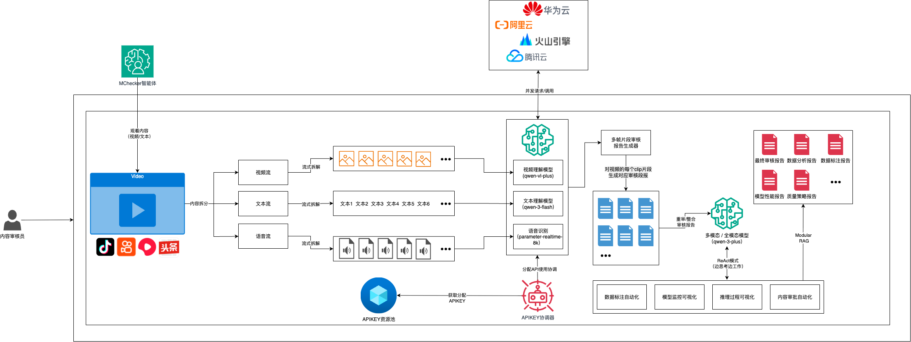
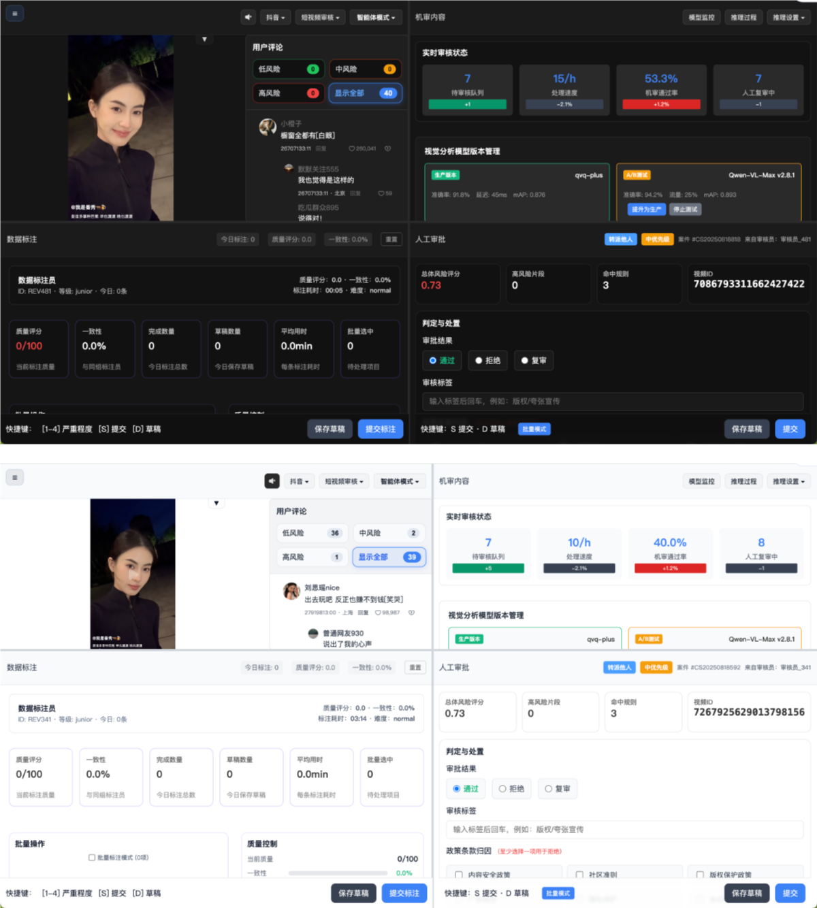
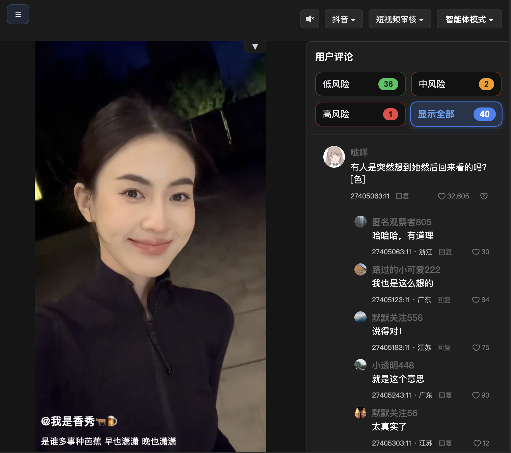
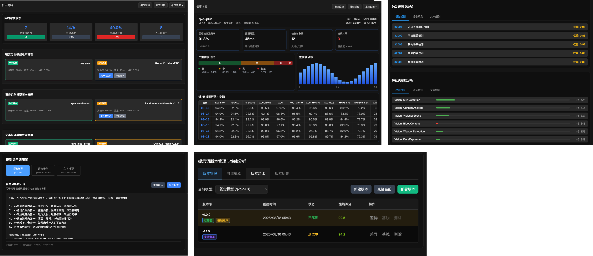
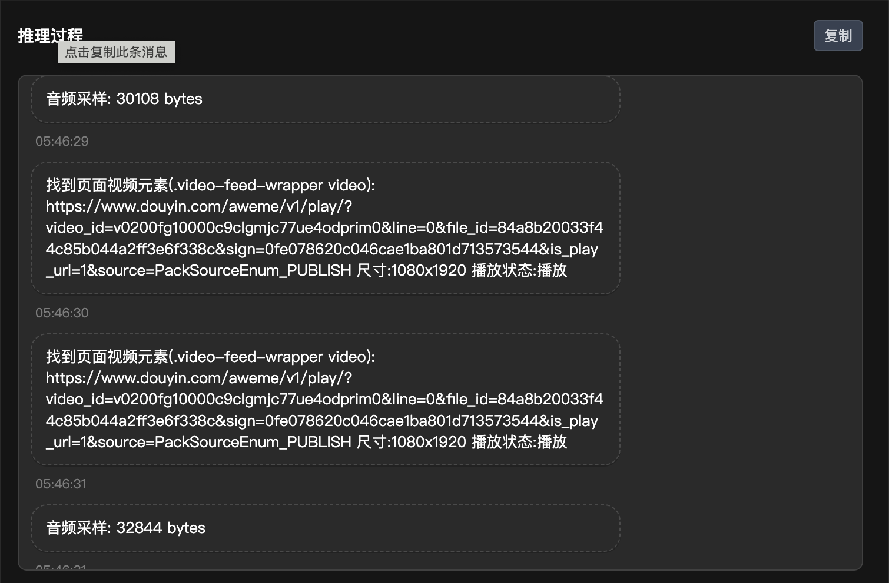
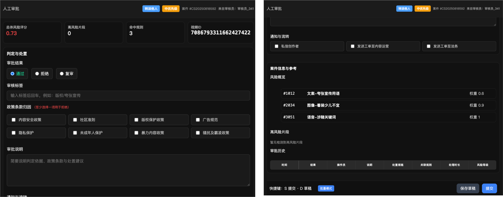
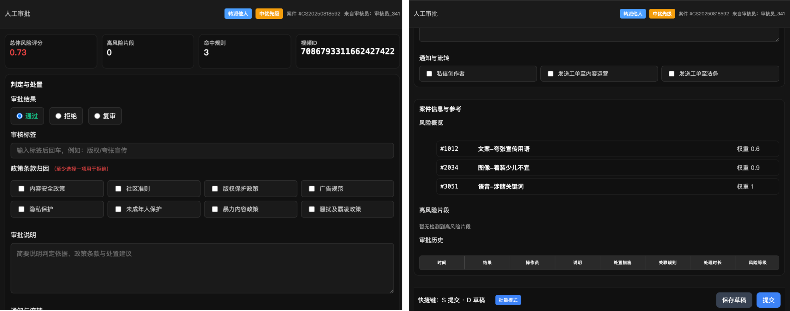
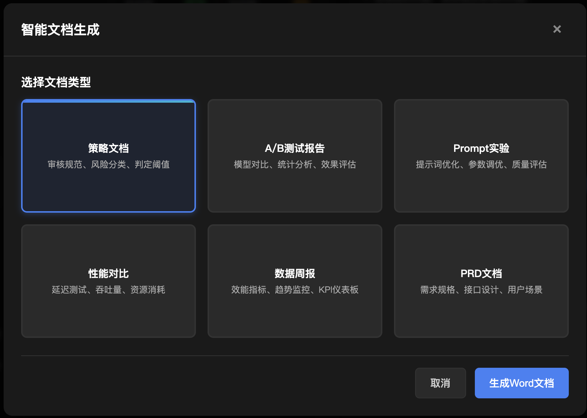
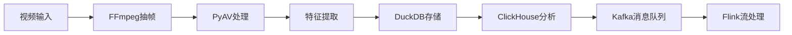

<div align="center">
    
# MChecker内容审核自动化项目


**🚀 开源AI内容审核全流程自动化平台**

一个集成多模态AI分析、实时流式处理、智能决策的完整内容审核解决方案

</div>

##  项目亮点

 **全流程自动化** - 从内容分析到审批决策的端到端自动化  
 **多模态AI集成** - 支持视频、音频、文本、图像的统一分析  
 **实时流式处理** - WebSocket实现毫秒级响应的实时审核  
 **智能监控面板** - 模型性能、风险分布、处理统计的可视化监控  
 **模块化设计** - 支持A/B测试、模型热切换、参数动态调优  
 **智能文档生成** - 基于RAG技术自动生成审核报告和策略文档  

##  系统架构

MChecker将传统分离的审核流程整合到统一平台：
-  **内容展示区** - 实时预览待审核内容
-  **AI分析引擎** - 多模态模型并行处理
-  **数据标注台** - 智能辅助的高效标注工具  
-  **审批决策中心** - 自动化或人工干预的审批流程

> **核心价值**: 一个运营人员即可完成内容审核员、数据标注员、模型监控员、文档专员的全部工作

##  演示说明

基于开源项目 [douyin](https://github.com/zyronon/douyin) 进行功能扩展：
-  保留原有短视频APP核心功能
-  增强审核控制面板和管理系统
- 🆕 新增AI分析引擎和自动化工具
-  集成完整的监控和报告系统

##  快速开始

### 环境要求
- Python 3.8+
- Node.js 16+
- Vue 3.x
- FFmpeg (用于视频处理)

### 安装部署

```bash
# 1. 克隆项目
git clone https://github.com/Chen-Jieteng/MChecker.git
cd MChecker

# 2. 后端服务
cd agent_backend
pip install -r requirements.txt
cp .env.example .env  # 配置API密钥
python main.py

# 3. 前端界面
cd MChecker
npm install
npm run dev

# 4. 访问系统
# 前端: http://localhost:3000
# 后端API: http://localhost:8799
```

### 配置API密钥

```bash
# 在 .env 文件中配置
DASHSCOPE_API_KEY=sk-your-api-key-here
DASHSCOPE_API_KEYS=sk-key1,sk-key2,sk-key3  # 多key负载均衡
```

##  完整系统演示

**整体工作流演示视频**

完整展示从内容审核、AI分析、人工决策到结果输出的全流程操作：

https://github.com/user-attachments/assets/63d2ab45-6211-47c6-bef2-84c94346252a


##  系统架构




##  平台界面展示

### 主控制台 - 四象限设计
统一工作台集成四大核心功能区域：



###  内容展示区
实时展示待审核的短视频内容和用户评论：



###  AI分析监控中心

**实时模型监控面板**
-  三种模型版本管理 (A/B测试支持)
-  实时性能指标：准确率、延迟、吞吐量
-  风险等级分布：低风险/中风险/高风险/封禁
-  置信度分布和检测统计

**核心监控指标**
- 模型性能：准确率、精确度、F1值、召回率、AUC
- 检测指标：mAP@0.5、mAP@0.75、平均IoU
- 系统指标：FPS、延迟、吞吐量、GPU占用率
- 质量评估：FPR、FNR、Cohen-K值、Matthews相关系数



###  提示词工程管理

**多模态提示词配置**
-  [视觉模型提示词](https://github.com/Chen-Jieteng/MChecker/blob/main/prompt/CV_prompt.md) - 图像/视频内容分析
-  [文本模型提示词](https://github.com/Chen-Jieteng/MChecker/blob/main/prompt/NLP_prompt.md) - 文本内容理解  
-  [语音模型提示词](https://github.com/Chen-Jieteng/MChecker/blob/main/prompt/speech_prompt.md) - 音频内容识别

**推理过程监控**
- 实时推理日志和性能分析
- 可调参数：执行步数(15)、频率(2s)、温度(0.3)、top_p(0.9)



###  智能数据标注台

高效的AI辅助标注工具，支持批量处理和质量控制：



###  人工审批决策中心

**智能审批工作流**
- 自动风险评估和初步判定
- 人工复审和最终决策
- 审批历史和决策追踪



**审核结果展示**
详细的审核报告和处理建议：


###  智能文档生成

基于RAG技术的自动化文档生成系统：



**文档生成演示视频**

展示智能文档生成的完整流程，从数据采集到最终文档输出：

https://github.com/user-attachments/assets/fde16c94-87f8-4ff5-9e77-eea45098d517


##  智能体运行模式

###  三种运行模式
- ** 单次测试模式** - 针对特定内容的一次性深度分析
- ** 监督处理模式** - AI分析+人工复审的混合决策流程  
- ** 无监督模式** - 全自动化的批量内容处理

###  自适应决策机制
- 基于置信度的智能路由
- 风险等级自动升级机制
- 人工干预阈值动态调整

##  技术架构

###  AI模型层 (支持A/B测试)

| 功能类型 | A组模型 | B组模型 | 用途 |
|---------|---------|---------|------|
| **视觉分析** | Qwen-VL-Plus | QVQ-Plus | 图像/视频内容理解 |
| **文本推理** | Qwen-Flash | QWQ-Plus-Latest | 文本内容分析 |
| **语音识别** | Paraformer-Realtime-8k | Qwen-Audio-ASR | 音频内容转录 |
| **多模态融合** | Qwen-Plus | - | 跨模态综合分析 |

###  数据处理层



###  服务架构层

**后端服务**
- **FastAPI** - 高性能异步API框架
- **WebSocket** - 实时双向通信
- **RESTful API** - 标准化接口设计

**前端界面**  
- **Vue 3.x** - 响应式用户界面
- **TypeScript** - 类型安全的开发体验
- **Vite** - 极速的构建工具

**基础设施**
- **Docker** - 容器化部署
- **Nginx** - 负载均衡和反向代理
- **Redis** - 缓存和会话管理


##  审核内容范围

###  多媒体内容类型
| 内容类型 | 覆盖范围 | 处理方式 |
|---------|---------|----------|
| ** 短视频** | 视频流、音频、封面图、标题文案 | 多模态并行分析 |
| ** 评论内容** | 文字、图片、表情包、回复树 | 上下文关联分析 |  
| ** 广告内容** | 推广视频、图片素材、文案 | 营销意图识别 |
| ** 直播内容** | 实时视频流、弹幕、礼物互动 | 流式实时监控 |

###  三层审核策略

```
 L1层 - 直接审核
├── 基础违规检测
└── 快速过滤机制

 L2层 - 风险分类 
├── 违规概率评分
└── 细粒度风险分级

 L3层 - 业务规则
├── 法律法规遵循
└── 平台政策应用
```

##  数据来源与测试策略

###  真实场景测试数据

**时间窗口策略** - 凌晨3-6点数据采集
>  选择依据：审核人员交班时段，机审模型压力测试的黄金时间

**关键词驱动采集**
-  搜索词："审核员睡着了"、"深夜内容"等
-  来源：开源douyin项目配套测试数据

###  测试案例分析

| 案例类型 | 存活时长 | 发现问题 | 解决方案 |
|---------|---------|----------|----------|
| **隐晦广告** | >3个月 | 传统模型漏检 | 多模态并行+上下文分析 |
| **边缘内容** | 5小时 | A/B组模型均失效 | 提示词增强+人工复审 |
| **争议内容** | 1小时 | 模型间判定差异 | 模型投票机制+置信度加权 |

###  辅助训练数据集

**开源数据集整合**
-  **NudeNet** - 不当图像识别基准
-  **YouTube-8M** - 大规模视频理解
-  **COCO数据集** - 目标检测对照组
-  **AVA数据集** - 违规内容识别
-  **OpenNSFW2** - 内容安全分类

##  智能文档生成系统

###  自动化报告类型

**核心文档输出**
-  **策略文档** - 审核规范、风险分类、判定阈值
-  **A/B测试报告** - 模型对比、统计分析、效果评估  
-  **Prompt优化报告** - 提示词实验、参数调优记录
-  **性能分析报告** - 延迟测试、吞吐量、资源消耗
-  **数据周报** - 效能指标、趋势监控、KPI仪表板
-  **PRD文档** - 需求规格、接口设计、用户场景

**技术实现** - 基于RAG(检索增强生成)技术

##  内容安全标准

###  核心过滤维度

| 检测类型 | 具体标准 | 检测方式 |
|---------|---------|----------|
| ** 文本内容** | 敏感词、政治敏感、违禁文案 | NLP+规则引擎 |
| ** 视觉内容** | 低俗画面、暴力、虚假广告 | 计算机视觉+OCR |
| ** AI生成** | 未标注AI内容、虚假信息 | 深度伪造检测 |
| ** 未成年人保护** | 不适宜内容、隐私保护 | 专项模型识别 |
| ** 直播监控** | 实时违规行为、互动内容 | 流式分析引擎 |


##  成本效益分析

###  模型调用成本测算

基于Qwen系列模型API的标准定价进行精确计算：

**基础参数**
-  平均视频时长：97.5秒 (15s-180s区间均值)
-  Token消耗率：1,639.7 input/s + 94.2 output/s  
-  定价：¥0.0015/千input + ¥0.0045/千output

###  单视频处理成本

| 成本项目 | 计算过程 | 金额 |
|---------|----------|------|
| **Input Token** | 1,639.7 × 97.5s = 159,802 tokens | ¥0.240 |
| **Output Token** | 94.2 × 97.5s = 9,165 tokens | ¥0.041 |
| **单视频总成本** | Input + Output | **¥0.281** |

###  规模化成本推算

**大规模应用场景** (按抖音日活数据)
-  日均新增视频：7,800万
-  日处理成本：¥0.281 × 78,000,000 = **¥2,191万**
-  月成本：约 **¥6.6亿**
-  年成本：约 **¥80亿**

###  成本优化策略

**智能分级处理**
-  L1快速过滤：降低80%无效调用
-  精准触发：仅对疑似内容深度分析  
-  缓存策略：相似内容复用结果

**部署优化方案**
-  **本地化部署** - 降低70%外部API成本
-  **级联处理** - 轻模型预筛 + 重模型精审
-  **抽样机制** - 智能采样降低处理量

>  **成本结论**: 通过智能优化，实际成本可控制在理论值的**20-30%**

##  隐私与合规

###  数据保护措施
-  **隐私脱敏** - 用户标识符自动匿名化处理
-  **数据分级** - 敏感信息分类存储和访问控制
- ⏰ **生命周期管理** - 数据自动清理和归档策略
-  **加密传输** - 端到端数据传输加密

###  合规框架
-  **开源协议** - 遵循MIT License开源协议
-  **国际标准** - 符合GDPR、CCPA等隐私法规
-  **本土合规** - 满足网络安全法、数据安全法要求

##  贡献与支持

###  核心贡献者
- **edwin99 (Chen-Jieteng)** - 项目发起人、架构设计

###  如何贡献
```bash
# 1. Fork项目
git fork https://github.com/Chen-Jieteng/MChecker

# 2. 创建特性分支  
git checkout -b feature/your-feature

# 3. 提交更改
git commit -m "Add your feature"

# 4. 推送分支
git push origin feature/your-feature

# 5. 创建Pull Request
```

###  联系方式
-  **问题反馈** - [GitHub Issues](https://github.com/Chen-Jieteng/MChecker/issues)
-  **商务合作** - 通过GitHub联系

---

<div align="center">

### ⭐ 如果这个项目对你有帮助，请给一个Star！


**让AI使得内容审核更智能、更高效！** 

</div>


